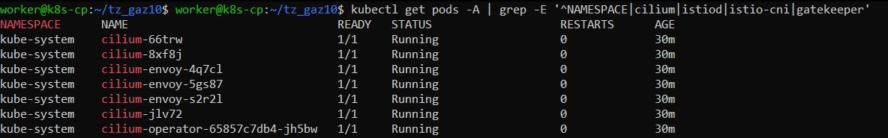
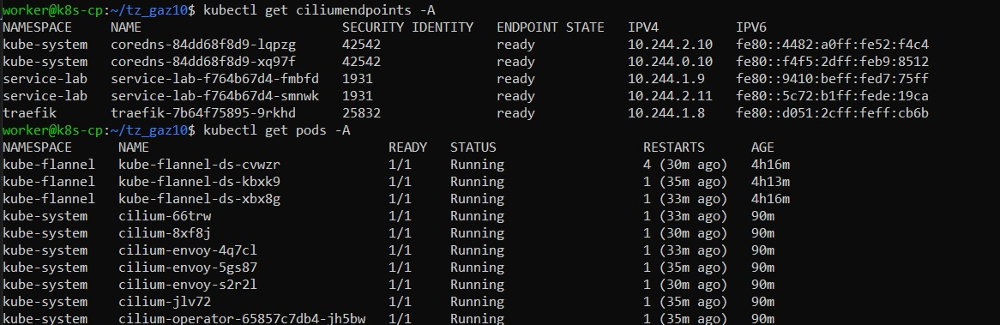
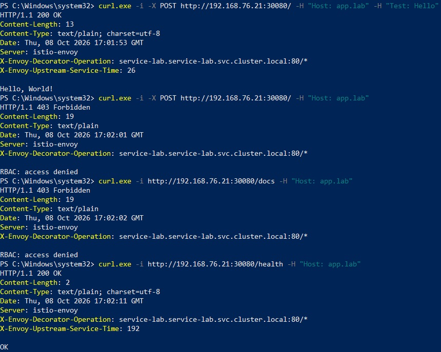
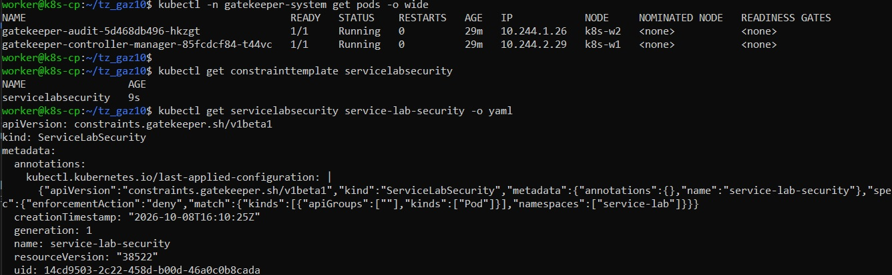
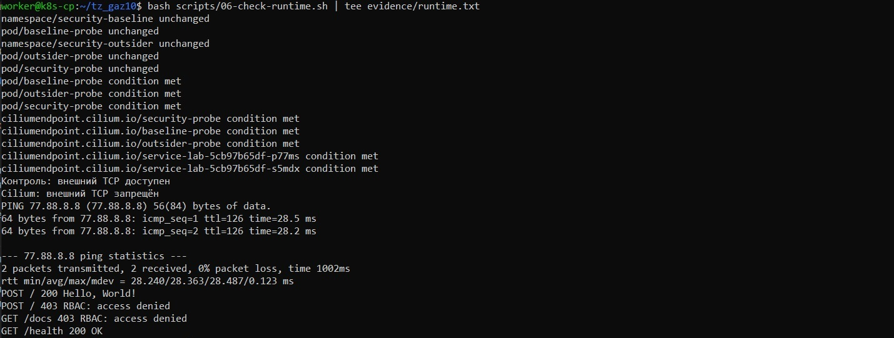
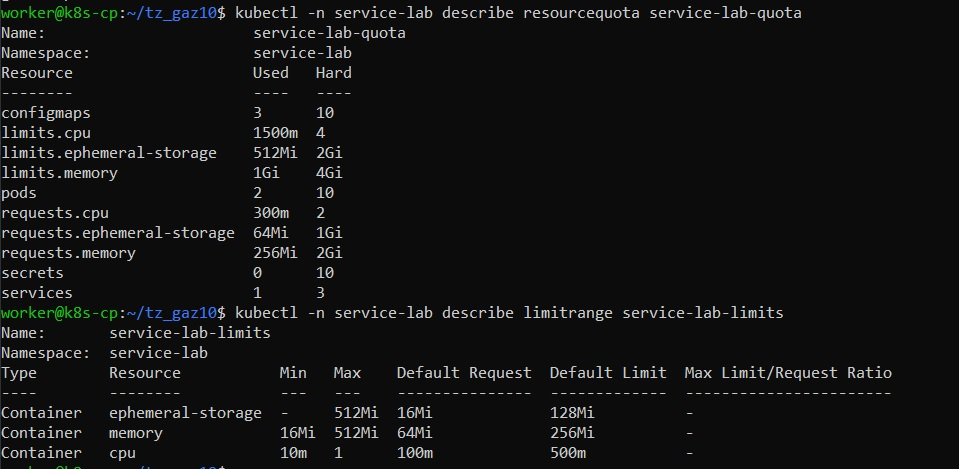
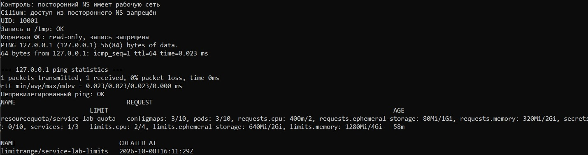
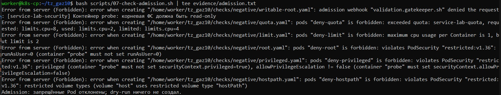

# 🛡️ Container Security Lab

Продолжение `service-lab` в отдельном репозитории. Защищаем приложение на существующем Kubernetes: Istio + Cilium + OPA Gatekeeper.

📖 [Установка по шагам](docs/SETUP.md) 

## 🧩 Что сделано

| Пункт ТЗ | Реализация |
| --- | --- |
| Расширения безопасности | Cilium 1.20.2, Istio 1.31.1, Gatekeeper 3.22.2 |
| Ограничение доступа | Cilium разрешает только нужные соединения; Istio проверяет HTTP-маршруты и заголовок |
| Ресурсы namespace | ResourceQuota + LimitRange для `service-lab` |
| Ресурсы Pod | requests/limits CPU, RAM и ephemeral-storage, включая sidecar |
| Пользователь и ФС | UID/GID 10001, read-only root, запись только в `/tmp`, drop ALL, seccomp |
| Проверка при создании | Gatekeeper + Pod Security Admission `restricted` |

Сеть остаётся `192.168.76.0/24`, шлюз `192.168.76.254`. Kubernetes 1.36, Flannel и Traefik из предыдущего задания сохраняются. Cilium подключается к Flannel через CNI chaining.

**Исключение для `/health`:** разрешён только ICMP Echo Request к `77.88.8.8`. Внешний TCP/HTTP запрещён. Istio `REGISTRY_ONLY` дополняет ограничения, а сетевой запрет обеспечивает Cilium. Traefik остаётся вне mesh, поэтому выбран `PERMISSIVE`, без заявления о строгом mTLS.

## 🚀 Запуск

Распакуй проект, создай отдельный GitHub-репозиторий `container-security-lab` и перенеси папку на control-plane. Сначала собери и импортируй образ на все ноды, затем выполни шаги из [инструкции](docs/SETUP.md).

```bash
bash scripts/00-preflight.sh
# Сохрани snapshots, проверь и скопируй CNI-конфиги на каждой ноде.
bash scripts/01-install-cilium.sh
# Проверь 05-cilium.conflist на всех трёх нодах.
bash scripts/02-recreate-baseline.sh
bash scripts/03-install-istio.sh
bash scripts/04-install-gatekeeper.sh
bash scripts/05-deploy-security.sh
bash scripts/06-check-runtime.sh
bash scripts/07-check-admission.sh
bash scripts/08-export-evidence.sh
```

Внешний вход остаётся через Ingress: `http://192.168.76.21:30080`, заголовок `Host: app.lab`. Port-forward не используется. Порт приложения внутри Pod - `8000`.

## 📸 Работа стенда

### 1. Расширения установлены



### 2. Cilium видит Pod приложения



### 3. Istio разрешает нужный запрос и блокирует лишний



### 4. Gatekeeper применяет политику



### 5. Внешний TCP запрещён, ping для /health работает



### 6. Квоты и лимиты namespace



### 7. UID 10001 и read-only файловая система



### 8. Небезопасные Pod отклоняются



## ✅ Проверка кода

```bash
python3 -m venv .venv
source .venv/bin/activate
pip install -r requirements-dev.txt -r requirements-check.txt
bash scripts/check-local.sh
pytest -q
# При установленном OPA: opa test --v0-compatible policy/ -v
# При установленном Helm: bash scripts/render-charts.sh
```

GitHub Actions настроен на проверку Python, YAML, Bash, Rego, Docker-образа, рендера Helm и Pod после Istio injection. Результаты выполненных локальных проверок записаны в [VALIDATION.md](docs/VALIDATION.md). Запуск на твоём Kubernetes и реальные скриншоты выполняются отдельно.
